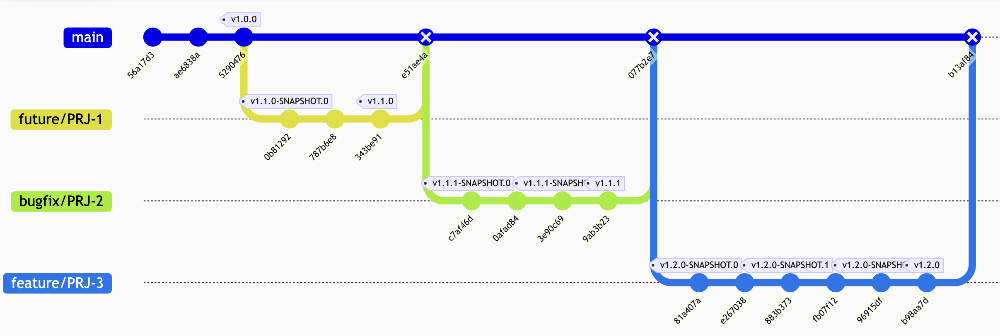

# diff-cover İle Yeni Kodun Test Kapsamına Alınması

Bu proje, Node.js ile geliştirilmiş bir komut satırı hesap makinesi uygulamasıdır. Git sürüm kontrolü, Jest test çerçevesi ve npm sürüm yönetimi ile birlikte kullanılmaktadır.



## Git ile Farkların Çıkarılması
`git diff` komutu, bir depo içindeki dosyalarda yapılan değişiklikleri satır satır gösterir. Bu komut ile iki commit, branch veya çalışma dizini arasındaki farkları görebilirsiniz.

**Örnekler:**

- Çalışma dizinindeki değişiklikleri göster:
  ```sh
  git diff
  ```

- Son **commit ile mevcut değişiklikler arası**ndaki farkı göster:
  ```sh
  git diff HEAD
  ```

- Belirli **iki commit arası**ndaki farkı göster:
  ```sh
  git diff v2.0.0 v2.0.1
  ```

- Sadece **belirli bir dosyada**ki değişiklikleri göster:
  ```sh
  git diff index.js
  ```

- Farkı bir dosyaya kaydet:
  ```sh
  git diff v2.0.0 v2.0.1 > changes.diff
  ```


## diff-cover 

```sh
# diff-cover kurulumu
pip install diff-cover

diff-cover --version
```

#### Yardım Almak

Tüm seçenekleri görmek için:

```sh
diff-cover --help
```


Test kapsamı raporlarını kullanarak değişiklik analizini aşağıdaki gibi yapabilirsiniz. `diff-cover` komutuna `--coverage-report` ile lcov dosyasının yolunu belirtmeniz gerekir. Jest ile oluşturulan kapsam raporu genellikle `coverage/lcov.info` dosyasında bulunur.

```zsh
# Değişiklik analizleri
# v2.0.0'dan v2.0.1'e değişiklikleri analiz et
git diff v2.0.0..v2.0.1 > changes.diff
diff-cover --diff-file changes.diff --compare-branch=v2.0.0 --coverage-report=coverage/lcov.info

# v2.0.1'den v2.1.0'a değişiklikleri analiz et
git diff v2.0.1..v2.1.0 > changes.diff
diff-cover --diff-file changes.diff --compare-branch=v2.0.1 coverage/lcov.info
```

`diff-cover`, kodunuzdaki değişikliklerin test kapsamını analiz etmek için kullanılır.

```zsh
usage: diff-cover [-h] 
                  [-c CONFIG_FILE] 
                  [--compare-branch BRANCH] 
                  [--diff-file DIFF_FILE]
                  [--diff-range-notation RANGE_NOTATION] 
                  [--exclude EXCLUDE [EXCLUDE ...]] 
                  [--expand-coverage-report] 
                  [--external-css-file FILENAME] 
                  [--fail-under SCORE] 
                  [--format FORMAT] 
                  [--ignore-staged] [--ignore-unstaged] [--include-untracked] 
                  [--ignore-whitespace] 
                  [--include INCLUDE [INCLUDE ...]] 
                  [--show-uncovered] 
                  [--src-roots DIRECTORY [DIRECTORY ...]] 
                  [-q] 
                  [--version]
                  coverage_file [coverage_file ...]
```

### diff-cover Kullanımı
Aşağıda temel kullanım örnekleri yer almaktadır:

#### Temel Kullanım
Bir diff dosyasındaki değişikliklerin test kapsamını analiz etmek için:

```zsh
diff-cover --diff-file changes.diff  coverage/lcov.info 

# veya 
diff-cover --diff-file=<(git diff) coverage/lcov.info
```

#### Rapor Oluşturma

Üç türlü raporlama yapıyor ve bunları eski (deprecated) usulde `--<format>-tür <dosya-yolu>`ancak yeni usulde `--format:<tür> <dosy-yolu>` oluyor.
```zsh
usage: diff-cover [-h] 
                  [--html-report HTML_REPORT] 
                  [--json-report JSON_REPORT] 
                  [--markdown-report MARKDOWN_REPORT] 
                  [--format FORMAT]

Automatically find diff lines that need test coverage.

optional arguments:
  -h, --help            show this help message and exit
  --html-report HTML_REPORT
  --json-report JSON_REPORT
  --markdown-report MARKDOWN_REPORT
  --format FORMAT
```

- `--format markdown:</cikti/dosya/adi.md`
  ```sh
  root@6a889e78437d:/workspace/hesap-makinesi# diff-cover --diff-file <(git diff) --format markdown:diff-cover.md  coverage/lcov.info
  -------------
  Diff Coverage
  Diff: origin/main...HEAD, staged and unstaged changes
  -------------
  No lines with coverage information in this diff.
  -------------

  root@6a889e78437d:/workspace/hesap-makinesi# head diff-cover.md 
  # Diff Coverage
  ## Diff: origin/main...HEAD, staged and unstaged changes

  No lines with coverage information in this diff.

  ```
- `--format html:</cikti/dosya/adi.html`
  ```sh
  root@6a889e78437d:/workspace/hesap-makinesi# diff-cover --diff-file <(git diff) --format html:diff-cover.html  coverage/lcov.info
  -------------
  Diff Coverage
  Diff: origin/main...HEAD, staged and unstaged changes
  -------------
  No lines with coverage information in this diff.
  -------------

  root@6a889e78437d:/workspace/hesap-makinesi# cat diff-cover.html 
  <!DOCTYPE html PUBLIC "-//W3C//DTD HTML 4.01//EN" "http://www.w3.org/TR/html4/strict.dtd">
  <html>
      <head>
          <meta http-equiv='Content-Type' content='text/html; charset=utf-8'>
          <title>Diff Coverage</title>
          <style>
              .src-snippet { margin-top: 2em; }
              .src-name { font-weight: bold; }
  ...
  ```
  ```sh
- `--format json:</cikti/dosya/adi.json`
  ```sh
  root@6a889e78437d:/workspace/hesap-makinesi# diff-cover --diff-file <(git diff) --format json:diff-cover.json  coverage/lcov.info
  -------------
  Diff Coverage
  Diff: origin/main...HEAD, staged and unstaged changes
  -------------
  No lines with coverage information in this diff.
  -------------

  root@6a889e78437d:/workspace/hesap-makinesi# jq . diff-cover.json 
  {
    "report_name": "LCOV",
    "diff_name": "origin/main...HEAD, staged and unstaged changes",
    "src_stats": {},
    "total_num_lines": 0,
    "total_num_violations": 0,
    "total_percent_covered": 100,
    "num_changed_lines": 0
  }
  root@6a889e78437d:/workspace/hesap-makinesi# 
  ```

- `--json-report diff-cover.json` Çıktıyı JSON formatında dosyasına yazar
  ```sh
  root@6a889e78437d:/workspace/hesap-makinesi# diff-cover --diff-file <(git diff) --json-report diff-cover.json coverage/lcov.info
  /usr/local/lib/python3.9/dist-packages/diff_cover/diff_cover_tool.py:304: UserWarning: The --json-report option is deprecated. Use --format json:diff-cover.json instead.
  warnings.warn(
  -------------
  Diff Coverage
  Diff: origin/main...HEAD, staged and unstaged changes
  -------------
  No lines with coverage information in this diff.
  -------------
  
  root@6a889e78437d:/workspace/hesap-makinesi# jq . diff-cover.json 
  {
    "report_name": "LCOV",
    "diff_name": "origin/main...HEAD, staged and unstaged changes",
    "src_stats": {},
    "total_num_lines": 0,
    "total_num_violations": 0,
    "total_percent_covered": 100,
    "num_changed_lines": 0
  }
  ```


## Başlangıç

### Proje Kurulumu

*Yapılacaklar:*

- Kaynak kodlar için `src` 
- test dosyaları için `__tests__` dizinlerini oluştur
- npm'i başlat
- git'i başlat
- git'e gönderilmeyecek dosya/dizin ayarları için .gitignore oluştur

```sh
mkdir -p hesap-makinesi/{src,__tests__}
cd hesap-makinesi

# node geliştirme başlasın
npm init -y
```

```sh
# git başlasın
git config --global user.email "cem.topkaya@telenity.com"
git config --global user.name "Cem Topkaya"
git config --global init.defaultBranch master
git init

# .gitignore dosyası oluşturma
cat > .gitignore << 'EOF'
coverage/
node_modules/
*.log
*.diff
coverage/
EOF

git add .
git commit -m "project and git initialized"
```

```sh
# herşey oldu mu kontrol edelim
git status 
git ls-files
```

Boş bir `index.js` oluşturalım ve npm start betiği koşsun diye `package.json`'ı güncelleyelim.

```sh
# .gitignore dosyası oluşturma
cat > index.js << 'EOF'
console.log("Huzurlarınızda 1.0.0 sürümü")
EOF

# package.json güncelleme
# "star": "node index.js"
cat > package.json << 'EOF'
{
  "name": "hesap-makinesi",
  "version": "0.0.0",
  "description": "",
  "main": "index.js",
  "scripts": {
    "start": "node index.js"
  },
  "keywords": [],
  "author": "",
  "license": "ISC"
}
EOF
```

Sürümlendirme ve git etiketleme zamanı:

```sh
git add .
git commit -m "Initial commit"
echo ">>>>>>>>----------------------"
jq .version package.json
npm version major -m "Version 1.0.0"
jq .version package.json
echo "-------------------<<<<<<<<<<<"
git tag -l --sort=creatordate
```


## Temel Dosyaların Oluşturulması

Bize bir görev açmışlar, PRJ-1 kodlu ve toplama özelliği katmamız isteniyor.
Görevimi *özellik* olduğu için `master`'dan `future/PRJ-1` dalı yaratacağız. 
Yeni özellik olduğu için `minor` değeri yukarı çekecek ve sürümü `1.1.0` yapacağız. 
Çalışmalarımızın arasında çıkaracağımız paketleri belirginleştirmek için sürümü `1.1.0-SNAPSHOT.0` diye yükselteceğiz.
Sürüm tamamlanınca `-SNAPSHOT.x` soneki gidecek ve `1.1.0` sürümü yayında olacak.

*Yapılacaklar:*
- yeni branş oluştur
- `package.json`'ın `version` değerini ve kodun bulunduğu yeri `1.1.0-SNAPSHOT.0` ile işaretle
- `topla` Fonksiyonunu oluşturalım 
- `node index.js 3 4` çalıştırdığımızda ekrana 7 sonucunu yazacak.
- `src/toplama.js` içindeki topla işlevini çağıracağımız `index.js` güncellenecek. 
- Sonra `package.json` içinde `npm start -- 3 4` komutunu karşılayacak `start` betiği.

```sh
# Yeni dal oluştur
git checkout -b future/PRJ-1
echo ">>>>>>>>----------------------"
jq .version package.json
npm version preminor --preid=SNAPSHOT -m "PRJ-1 için kodlamaya başlandı. v1.1.0-SNAPSHOT.0"
jq .version package.json
echo "-------------------<<<<<<<<<<<"

# Toplama modülü
cat > src/toplama.js << 'EOF'
function topla(a, b) {
  return a + b;
}

module.exports = { topla };
EOF
```

Uygulamanın giriş kodu olan `index.js`'i yazalım:

```sh
# Ana uygulama dosyası
cat > index.js << 'EOF'
const { topla } = require("./src/toplama");

if (process.argv.length < 4) {
  console.log("Lütfen iki sayı giriniz");
  process.exit(1);
}

const arg1 = process.argv[2];
const arg2 = process.argv[3];

const sonuc = topla(arg1, arg2);
console.log(`Sonuç: ${sonuc}`);
EOF
```

**Yapılacaklar:**

1. `npm [start|test]` İle test koşmak için betikleri `package.json`'a yazalım.
1. `jest` yükleyelim
1. Jest için ayar dosyası olan `jest.config.js`'i oluşturalım
1. Birim test kodunu yazalım
1. Testleri koşalım

### 1. package.json'ın test Betiğini Değiştirelim
```sh
# package.json güncelleme
# "test": "jest --collect-coverage"
cat > package.json << 'EOF'
{
  "name": "hesap-makinesi",
  "version": "1.1.0-SNAPSHOT.0",
  "description": "",
  "main": "index.js",
  "scripts": {
    "start": "node index.js",
    "test": "jest --collect-coverage"
  },
  "keywords": [],
  "author": "",
  "license": "ISC"
}
EOF
```

### 2. Jest Kurulumu
```sh
npm install --save-dev jest
```

### 3. Jest Yapılandırma
```sh
cat > jest.config.js << 'EOF'
module.exports = {
  testMatch: ['**/*.spec.js'], // Sadece .spec.js dosyalarını test et
  collectCoverage: true,       // Kapsama raporu toplansın
  collectCoverageFrom: [       // Kapsama raporuna dahil edilecek tüm js dosyaları
    '!index.js',               // CLI Tarafından çağırıldığı için birim test kapsama raporunda hep %0 çıkacak, bu sepeble ihmal ediyoruz
    'src/**/*.js',
    '!**/*.spec.js',           // Test dosyaları kapsama dışında tutulabilir
    '!node_modules/**',
    "!coverage/**",
  ],
  coverageReporters: ['text', 'lcov'], // Rapor formatları
};
EOF
```


### 3. Birim Test Yazalım

*Test Dosyaları:*

```sh
# Toplama testleri
cat > __tests__/toplama.spec.js << 'EOF'
const { topla } = require("../src/toplama");

describe("Toplama Fonksiyonu", () => {
  test("İki sayıyı doğru toplar", () => {
    expect(topla(2, 3)).toBe(5);
  });
});
EOF
```

### 4. Birim Testleri Koşalım
```sh
npm test
```

Projeden bir paket çıkartılabilsin diye yeni dalımıza *commit* yapalım.
Burada niyetimiz ara paket çıkarırken SNAPSHOT etiketiyle artifaktı ve commit'i işaretlemek.

```sh
git add .
git commit -m "PRJ-1: Add initial implementation for toplama feature"
```

Sürüm yapalım.
```sh
echo ">>>>>>>>----------------------"
jq .version package.json
npm version prerelease -m "PRJ-1: için kodlamaya başlandı. v1.1.0-SNAPSHOT.1"
jq .version package.json
echo "-------------------<<<<<<<<<<<"
```

Şimdi string değerlerin toplanamayacağı için sayi1 ve sayi2'yi sayıya dönüştürelim.

```sh
# Ana uygulama dosyası
cat > index.js << 'EOF'
const { topla } = require("./src/toplama");

if (process.argv.length < 4) {
  console.log("Lütfen iki sayı giriniz");
  process.exit(1);
}

const sayi1 = parseFloat(process.argv[2]);
const sayi2 = parseFloat(process.argv[3]);

const sonuc = topla(sayi1, sayi2);
console.log(`Sonuç: ${sonuc}`);
EOF
```

Testi koşalım (`npm test`), başardığımızı ve %100 kapsama raporunu görerek sürüm yapalım:

```
root@6a889e78437d:/workspace/hesap-makinesi# npm test

> hesap-makinesi@1.1.0-SNAPSHOT.0 test
> jest --collect-coverage

 PASS  __tests__/toplama.spec.js
  Toplama Fonksiyonu
    ✓ İki sayıyı doğru toplar (18 ms)

------------|---------|----------|---------|---------|-------------------
File        | % Stmts | % Branch | % Funcs | % Lines | Uncovered Line #s 
------------|---------|----------|---------|---------|-------------------
All files   |     100 |      100 |     100 |     100 |                   
 toplama.js |     100 |      100 |     100 |     100 |                   
------------|---------|----------|---------|---------|-------------------
Test Suites: 1 passed, 1 total
Tests:       1 passed, 1 total
Snapshots:   0 total
Time:        5.939 s
Ran all test suites.
```


> Birim testlerin %100 kod kapsamasıyla 1.1.0 sürümünü tamamladık.
> Artık prerelease yapmadan, versiyonu 1.1.0-SNAPSHOT.1'den 1.1.0'a çekelim.
> Değişimlerimizi commit edelim. Commit ettiğimiz yeri git etiketiyle işaretleyelim.

```sh
git add .
git commit -m "PRJ-1: Addition feature completed"
echo ">>>>>>>>----------------------"
jq .version package.json
npm version minor -m "Version 1.1.0"
jq .version package.json
echo "-------------------<<<<<<<<<<<"
git checkout master
git merge  --no-ff future/PRJ-1  -m "Merge branch 'future/PRJ-1' into master"
```

## Test Kapsama Oranımızı Düşürelim

`PRJ-2` Görevi açılıyor ve deniyor ki; topla işlevine gelen parametrelerin doğrulaması eksik!
Gelen değerler `NaN` ise hatalı girdi mesajı verip uygulamadan çıkılacak.
Sayı iseler program akışı devam edecek. 

Bu değişimi `bugfix/PRJ-2` dalı yaratıp yapacak ancak if NaN dalının testini eksik bırakacağız (teknik borç).
Daha sonra gelecek işi yaparken diff-cover ile yeni yazılan kodların testinin yapılıp yapılmadığına odaklanacağız.
Teknik borcu yeni özellik geliştirirken kapatmayacağız. 

Hedef sürüm numaramız `1.1.1`.

```sh
git checkout -b bugfix/PRJ-2
echo ">>>>>>>>----------------------"
jq .version package.json
npm version prepatch --preid=SNAPSHOT -m "PRJ-2: Start 1.1.1-SNAPSHOT.0"
jq .version package.json
echo "-------------------<<<<<<<<<<<"
```

#### Kod Değişiklikleri
Aşağıdaki kod değişiklikleri, `toplama.js` dosyasına kullanıcıdan alınan sayıların gerçekten sayı olup olmadığını kontrol eden ek doğrulama ekler. Hususi olarak iki `if` ifadesiyle bu doğrulamayı dallandırmak istiyoruz. Böylece test sonuçlarında `Line` ve `Branch` yüzdesinin düştüğünü göreceğiz. Eğer ilk veya ikinci argüman geçerli bir sayı değilse, kullanıcıya özel bir hata mesajı gösterilir ve uygulama sonlandırılır. Böylece yanlış girişlerin önüne geçilmiş olur.

```sh
cat > ./src/toplama.js << 'EOF'
function topla(a, b) {

  if (isNaN(a)) {
    console.log("İlk argüman sayı değil");
    return NaN;
  }

  if (isNaN(b)) {
    console.log("İkinci argüman sayı değil");
    return NaN
  }

  return a + b;
}

module.exports = { topla };
EOF

cat > ./__tests__/toplama.spec.js << 'EOF'
const { topla } = require("../src/toplama");

describe("Toplama Fonksiyonu", () => {
  test("İki sayıyı doğru toplar", () => {
    expect(topla(2, 3)).toBe(5);
  });

  test("Sadece a sayısı NaN ise uyarı verir ve sonuç NaN olur", () => {
    const consoleSpy = jest.spyOn(console, "log").mockImplementation(() => {});
    expect(topla("abc", 5)).toBeNaN();
    expect(topla("abc", "xyz")).toBeNaN(); // b de NaN olsa da sadece a kontrol ediliyor
    expect(topla(NaN, 10)).toBeNaN();
    expect(topla(undefined, 7)).toBeNaN();
    expect(topla(null, 7)).not.toBeNaN(); // null sayısal olarak 0 kabul edilir
    expect(consoleSpy).toHaveBeenCalledWith("İlk argüman sayı değil");
    consoleSpy.mockRestore();
  });

});
EOF
```


```sh
git add .
git commit -m "PRJ-2: Add number validation"
echo ">>>>>>>>----------------------"
jq .version package.json
npm version prerelease -m "PRJ-2: Update to 1.1.1-SNAPSHOT.1"
jq .version package.json
echo "-------------------<<<<<<<<<<<"
```


**Sürüm Zamanı (1.1.1)**

Testi geçsin coverage zaten teknik borç ;)

```sh
npm test
```

```
# npm test

> hesap-makinesi@1.1.1-SNAPSHOT.1 test
> jest --collect-coverage

 PASS  __tests__/toplama.spec.js (8.465 s)
  Toplama Fonksiyonu
    ✓ İki sayıyı doğru toplar (21 ms)
    ✓ Sadece a sayısı NaN ise uyarı verir ve sonuç NaN olur (19 ms)

------------|---------|----------|---------|---------|-------------------
File        | % Stmts | % Branch | % Funcs | % Lines | Uncovered Line #s 
------------|---------|----------|---------|---------|-------------------
All files   |      75 |       75 |     100 |      75 |                   
 toplama.js |      75 |       75 |     100 |      75 | 9-10              
------------|---------|----------|---------|---------|-------------------
Test Suites: 1 passed, 1 total
Tests:       2 passed, 2 total
Snapshots:   0 total
Time:        11.346 s
Ran all test suites.
```

Teknik borcumuzu %75 dallanma kapsama oranıyla aldık gidiyoruz.

```sh
echo ">>>>>>>>----------------------"
jq .version package.json
npm version patch -m "PRJ-2: Version 1.1.1"
jq .version package.json
echo "-------------------<<<<<<<<<<<"

# Main'e merge
git checkout master
git merge  --no-ff bugfix/PRJ-2  -m "Merge branch 'bugfix/PRJ-2' into master"
# git branch -d bugfix/PRJ-2
```

# Çıkarma Özelliği (PRJ-3)

Çıkarma özelliğini kazandırmamız için `PRJ-3` görevini oluşturdular.
`future/PRJ-3` isimli bir dal ve `1.2.0` sürümüne ulaşmak için `-SNAPSHOT.0`'lı ara sürümler de gerekecek.  

```sh
git checkout -b feature/PRJ-3
npm version preminor --preid=SNAPSHOT -m "Start 1.2.0-SNAPSHOT.0"
```

Çıkarma Özelliği Ekleme

```sh
# Çıkarma modülü
cat > ./src/cikarma.js << 'EOF'
function cikar(a, b) {
  return a - b;
}

module.exports = { cikar };
EOF

# Uygulama güncellemesi
cat > index.js << 'EOF'
const { topla } = require("./src/toplama");
const { cikar } = require("./src/cikarma");

if (process.argv.length < 5) {
  console.log("Lütfen iki sayı ve işlem türünü giriniz");
  process.exit(1);
}

const sayi1 = parseFloat(process.argv[2]);
const sayi2 = parseFloat(process.argv[3]);
const islem = process.argv[4]

let sonuc;
if (islem === "topla") {
  sonuc = topla(sayi1, sayi2);
} else if (islem === "cikar") {
  sonuc = cikar(sayi1, sayi2);
} else {
  console.log("Geçersiz işlem. 'topla' veya 'cikar' kullanın");
  process.exit(1);
}

console.log(`Sonuç: ${sonuc}`);
EOF
```

```sh
git add .
git commit -m "PRJ-3: Add subtraction feature"
npm version prerelease -m "Update to 1.2.0-SNAPSHOT.1"
```

Testlerin Eklenmesi

```sh
# Çıkarma testleri
cat > __tests__/cikarma.spec.js << 'EOF'
const { cikar } = require("../src/cikarma");

describe("Çıkarma Fonksiyonu", () => {
  test("İki sayıyı doğru çıkarır", () => {
    expect(cikar(5, 3)).toBe(2);
  });
});
EOF
```

Bir commit daha. Ve SNAPSHOT 1 daha arttırılsın:

```sh
git add .
git commit -m "PRJ-3: Add subtraction tests"
npm version prerelease -m "Update to 1.2.0-SNAPSHOT.2"
```

Test kapsama raporununa ihtiyacımız var. Unutmayalımki teknik borcumuz devam ediyor.

```sh
npm test
```

Yeni kodlarımızın testini %100 tamamlamış olsak bile geçmişten gelen noksanlar yüzünden ortalama düşük.

```
# npm test

> hesap-makinesi@1.2.0-SNAPSHOT.2 test
> jest --collect-coverage

 PASS  __tests__/toplama.spec.js (8.384 s)
 PASS  __tests__/cikarma.spec.js (11.864 s)
------------|---------|----------|---------|---------|-------------------
File        | % Stmts | % Branch | % Funcs | % Lines | Uncovered Line #s 
------------|---------|----------|---------|---------|-------------------
All files   |      80 |       75 |     100 |      80 |                   
 cikarma.js |     100 |      100 |     100 |     100 |                   
 toplama.js |      75 |       75 |     100 |      75 | 9-10              
------------|---------|----------|---------|---------|-------------------

Test Suites: 2 passed, 2 total
Tests:       3 passed, 3 total
Snapshots:   0 total
Time:        16.532 s
Ran all test suites.
```

Son işimiz olan PRJ-3 için yazdığımız kodların kapsama oranı %100 ise sürümü yapacağız.
Eski birim testlerin yazılması işini erteleyebileceğiz. Bunu `diff-cover` ile yapalım.
`1.1.1` Etiketimizle son commit olan `HEAD` arasındaki kod değişimleri testlerden geçmiş mi?


```sh
git tag -l --sort=creatordate
diff-cover --diff-file <(git diff v1.1.1..HEAD) --fail-under 100 coverage/lcov.info
```

Değişen sadece cikarma.js olmuş ve %100 kodumuzu kapsamış testlerimiz.

```
# diff-cover --diff-file <(git diff v1.1.1..HEAD) --fail-under 100 coverage/lcov.info
-------------
Diff Coverage
Diff: origin/main...HEAD, staged and unstaged changes
-------------
src/cikarma.js (100%)
-------------
Total:   2 lines
Missing: 0 lines
Coverage: 100%
-------------
```

**Nihai Sürüm (1.2.0)**

```sh
npm version minor -m "PRJ-3: Version 1.2.0"

# Main'e merge
git checkout master
git merge  --no-ff future/PRJ-3 -m "Merge branch 'future/PRJ-3' into master"
# git branch -d feature/PRJ-3
```
